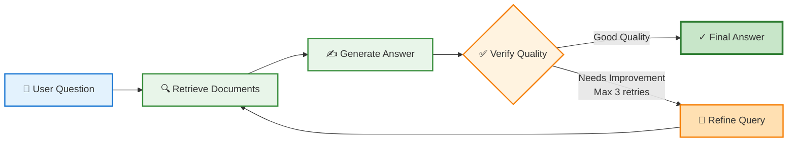

# Smart RAG Flow Diagram

## Simplified Workflow

## How It Works

1. **User Question** - User submits a question about uploaded documents
2. **Retrieve Documents** - Vector search finds top 4 relevant document chunks
3. **Generate Answer** - LLM creates answer using only retrieved context
4. **Verify Quality** - System checks if answer is well-supported and useful
5. **Refine Query** (if needed) - Rewrites query with better keywords and retries
6. **Final Answer** - Returns validated, high-quality answer to user

## Key Features

- ✅ Grounded in document context
- ✅ Quality verification loop
- ✅ Automatic query refinement
- ✅ Maximum 3 retry attempts
- ✅ Fallback to "No answer found" if quality threshold not met
